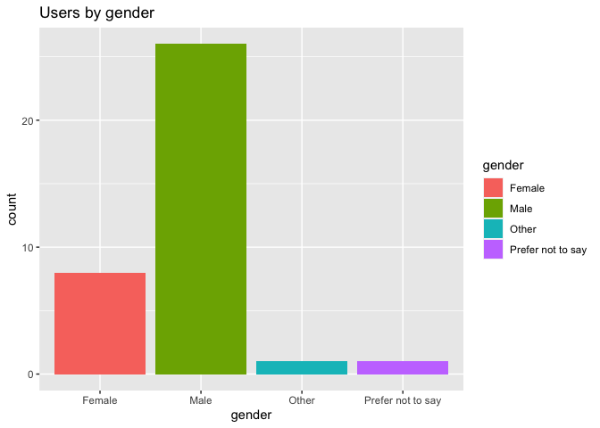
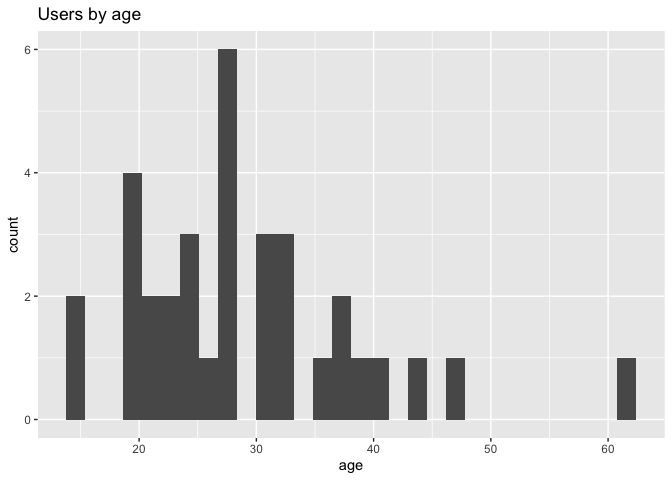
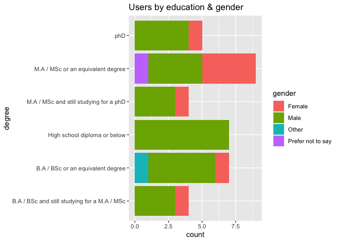
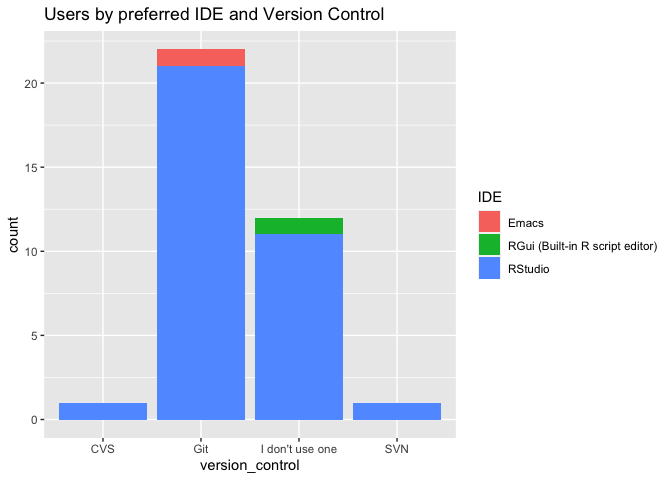
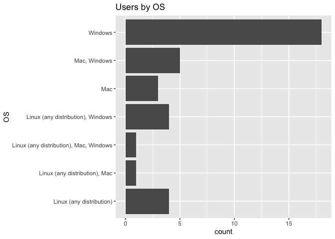
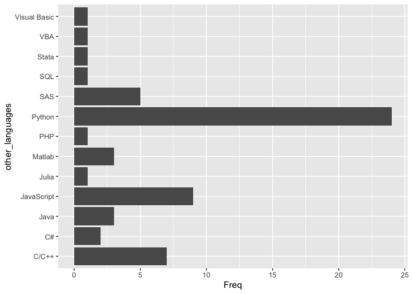

DiscoRd Survey
================

# DiscoRd Survey Results

Survey of the membership of the R Programming focused discord server
`discoRd`. Rough and dirty EDA.

``` r
library(googlesheets4)
library(tidyverse)
```

    ## ── Attaching packages ─────────────────────────────────────── tidyverse 1.3.0 ──

    ## ✓ ggplot2 3.3.2     ✓ purrr   0.3.4
    ## ✓ tibble  3.0.6     ✓ dplyr   1.0.4
    ## ✓ tidyr   1.1.2     ✓ stringr 1.4.0
    ## ✓ readr   1.4.0     ✓ forcats 0.5.0

    ## ── Conflicts ────────────────────────────────────────── tidyverse_conflicts() ──
    ## x dplyr::filter() masks stats::filter()
    ## x dplyr::lag()    masks stats::lag()

``` r
`%notin%` <- Negate(`%in%`)

gs4_deauth()
survey_results <-
  read_sheet("14qV7qpPso4o8PBIOZVbSH8sD_tx8fkJh_fgHgRNqvQM")
```

    ## Reading from "discoRd_Member_Survey _Responses"

    ## Range "Responses"

``` r
survey_results_cleaned <- survey_results %>%
  rename(
    "gender" = "What is your gender?",
    "age" = "What is your age?",
    "country" = "Country of residence?",
    "degree" = "Highest academic degree?",
    "discipline" = "Field of study?",
    "industry" = "What industry do you work in?",
    "discovery_path" = "How did you hear about discoRd?",
    "discord_platform" = "What platform do you use to browse discord the most?",
    "discord_channel" = "What is your favorite discoRd channel?",
    "rate_to_friend" = "On a scale of 1 to 10, how likely would you recommend discoRd server to a friend?",
    "OS" = "What operating system do you use?",
    "RAM" = "How much RAM do you have on the computer where R is installed (in GB)?",
    "version_control" = "What version control software do you use?",
    "IDE" = "What's your favorite Integrated Development Environment (IDE)/text editor to program in R",
    "self_assess_skill" = "How would you self-assess your skill level in R?",
    "years_programming" = "How long have you been programming in general? (in years)",
    "years_programming_r" = "How long have you been programming in R? (in years)",
    "other_languages" = "What other programming languages besides R do you use?",
    "how_learned_r" = "How did you learn R? (pick the most used method)",
    "reason_learned_r" =  "What is the reason you learned R? (pick one)",
    "like_about_r" = "What did you like the most about R?",
    "enjoy_r" = "On a scale of 1 to 10, how much do you enjoy using R?",
    "recommend_r" = "On a scale of 1 to 10, how likely would you recommend R to someone new to programming?",
    "resources" = "What resources have you used before for help or reference?",
    "fav_wrangling_pkg" = "Favorite R data wrangling/data cleaning package? (at most 3)",
    "fav_viz_pkg" = "Favorite R data visualization packages? (at most 3)",
    "fav_dash_pkg" = "Favorite R reporting/dashboarding packages? (at most 3)",
    "fav_dataset" = "Favorite built-in dataset in R? (at most 3)"
  ) %>%
  select(-c(`What is two times two? (Write the word for the answer. E.g. \"six\" is the answer for two times three)`,`Future survey question 1`,`Future survey question 2`,`Future survey question 3`,`Future survey question 4`,`Future survey question 5`))
```

## Demographics

``` r
ggplot(survey_results_cleaned,aes(x=gender,fill=gender)) +
  geom_bar() +
  labs(title="Users by gender")
```

<!-- -->

``` r
ggplot(survey_results_cleaned,aes(x=age)) +
  geom_histogram() +
  labs(title = "Users by age")
```

    ## `stat_bin()` using `bins = 30`. Pick better value with `binwidth`.

    ## Warning: Removed 2 rows containing non-finite values (stat_bin).

<!-- -->

``` r
 ggplot(survey_results_cleaned,aes(x=degree,fill=gender)) +
  geom_bar() +
  coord_flip() +
  labs(title = "Users by education & gender")
```

<!-- -->

## Favored Tools

``` r
 ggplot(survey_results_cleaned,aes(x=version_control,fill=IDE)) +
  geom_bar() +
  labs(title = "Users by preferred IDE and Version Control")
```

<!-- -->

``` r
 ggplot(survey_results_cleaned,aes(x=OS)) +
  geom_bar() +
  labs(title = "Users by OS") +
  coord_flip()
```

<!-- -->

``` r
#need to sort out the multiple options
```

``` r
other_languages <- survey_results_cleaned$other_languages %>%
  str_split(",") %>%
  unlist() %>% 
  trimws() 

other_languages <- data.frame(table(other_languages)) %>%
  filter(other_languages %notin% c("None","none"))

ggplot(other_languages,aes(x=other_languages,y=Freq)) +
  geom_bar(stat="identity") +
  coord_flip()
```

<!-- -->
